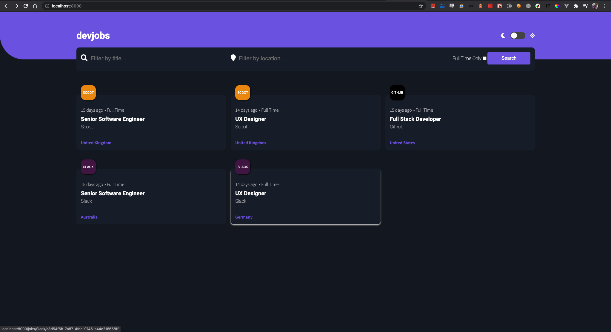
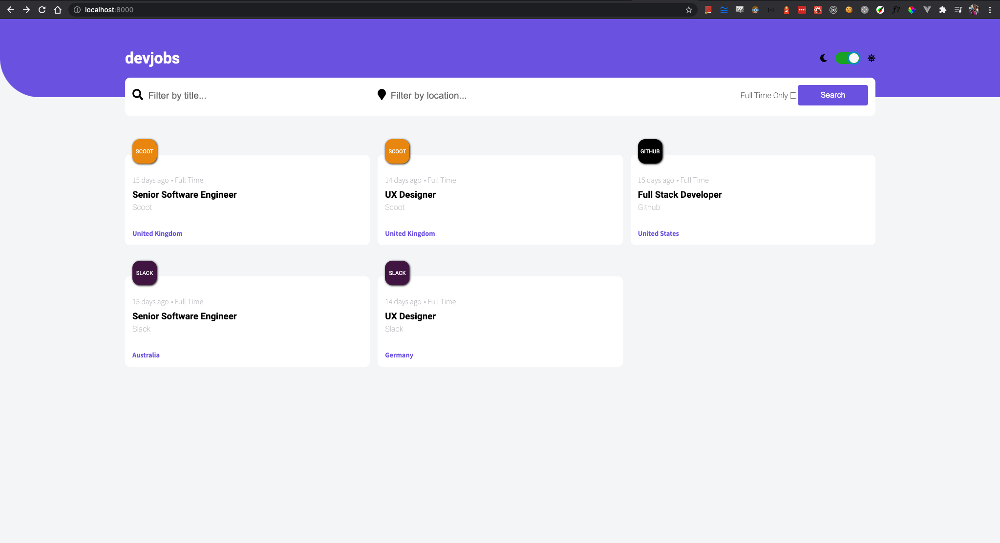
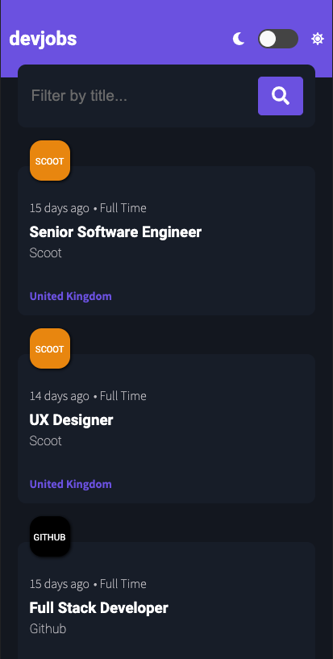
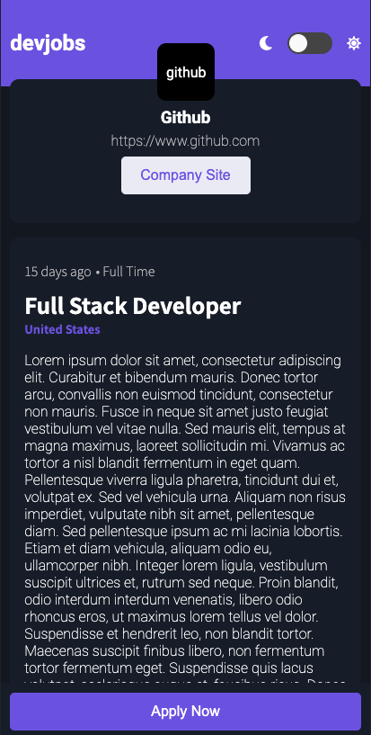

<h1 align="center">
  Devjobs: A Static Job Board
</h1>

## Commands

To get up and running is easy

```shell
#start development server for Gatsby
yarn develop
```

```shell
#start jest and run tests, can use test:watch to keep watching for changes
yarn test
```

## Overview


This is a test gatsby static site that was inspired by [this site idea](https://www.frontendmentor.io/challenges/devjobs-web-app-HuvC_LP4l) and I just went and built it out a bit differently. All the data is stored in the `JOB_DATA.JSON` file and can be replaced or modified as required. The theming is enabled to switch between light and dark



The site is also fully mobile friendly



and container a detail page for the breakdown of the job information



This was more a CSS exercise but it did also test some interesting use cases in Gatsby as well which is one technology I have not used a lot but am rather enjoying for the specific use cases.

## Testing

Tests have been written in Jest and there is snapshot tests for the components and unit tests for the logic

## Technologies

<p align="center">
  <a href="https://www.gatsbyjs.com/?utm_source=starter&utm_medium=readme&utm_campaign=minimal-starter">
    
  </a>
</p>
